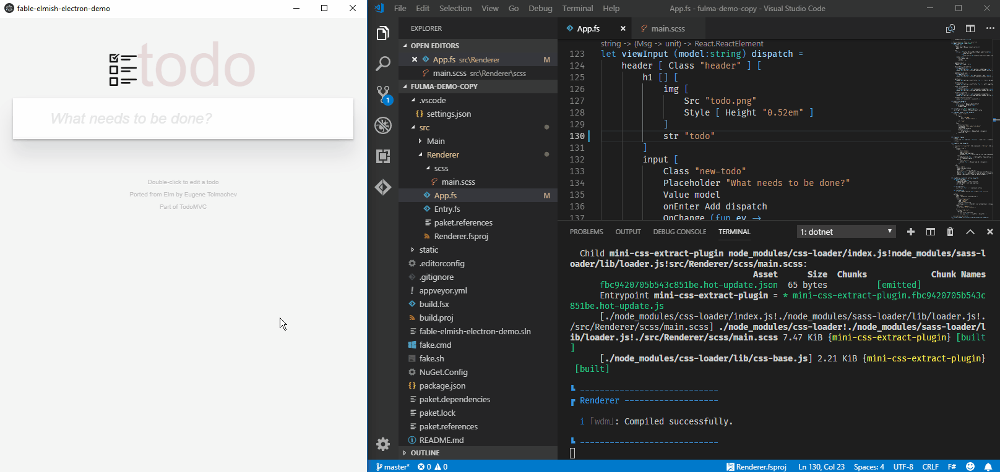
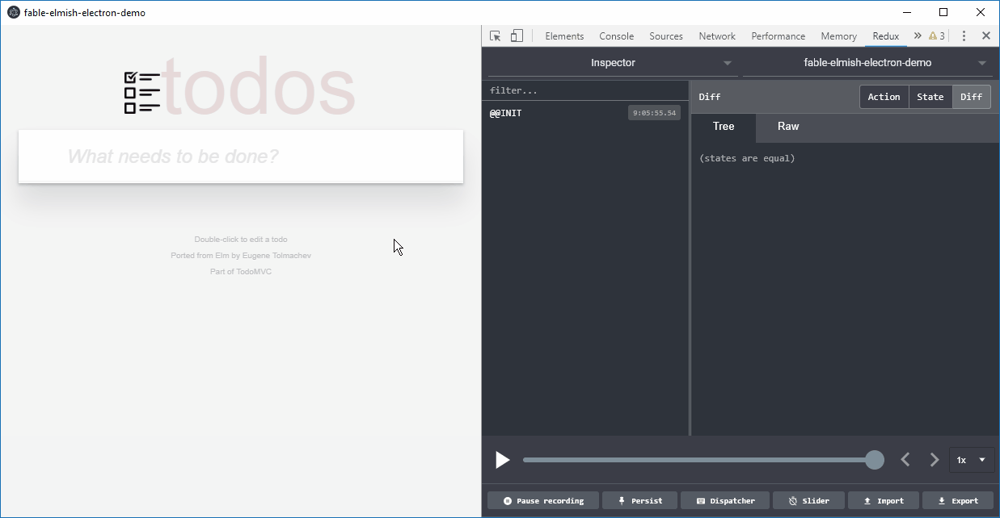

# Fable-Elmish-Electron-Material-UI demo 

This is an example of an F# Electron app centered around Fable 2 and Elmish. The actual app contents (which you can easily replace to build your own Electron app) are intended to show how to use Material-UI (including JSS/style-as-code) as well as serve as examples of how to implement some (not always trivial) UX patterns in Elmish.

To use the demo for scaffolding your own Fable/Elmish/Electron apps, simply clone the repo and start hackin' on the `Renderer` project to get started (details below).

Features/stack:
* Hot module reloading for both code and styles
* Time-travel debugging (using Redux DevTools, RemoteDev, and Fable.Elmish.Debugger)
* Single-command development and packaging with FAKE
* [electron-webpack](https://webpack.electron.build/) takes care of most of the webpack config
* [electron-builder](https://www.electron.build/) packages the app (see their documentation for how to customize)
* [electron-window-state](https://github.com/mawie81/electron-window-state/) for remembering window state between launches
* [Devtron](https://electronjs.org/devtron) for Electron-specific debugging/linting

Stuff demoed:

* Autocomplete
* Badges
* Dialogs
* Selects (dropdowns)
* Snackbars
* Static assets (images etc.)
* Text fields / input validation

There are a lot of files in this repo that do not pertain to the actual app source code. These are mostly well commented in order to explain why they are needed. If you see something but don't understand why it's there, feel free to open an issue.

### Hot module reloading in action

### Time-travel debugging in action

## Requirements

* .NET Core
* Yarn (probably easy to change to npm if you prefer that)

## How to develop

`./fake.cmd build -t Dev` (default target)

After the app starts, edit the renderer project in `/src/Renderer` and see the changes appear in real-time thanks to hot module reloading.

Place static files in the root `/static` folder as required by electron-webpack. See the code for the “Static assets” page (and the helpers in `Utils.fs`) to see how to use them.

## Release build to unpacked directory

`./fake.cmd build -t DistDir`

## Release build to packed installer

`./fake.cmd build -t Dist`

## Disclaimer 🤯

I am very new to Fable, Electron and the modern JS/Node stack. This example/boilerplate is the result of my banging my head against a wall for several months trying to understand the byzantine packaging and build systems of modern JS for the first time, getting them to play nicely with Electron and Fable 2, and generally learning Fable/Elmish/React/Material-UI.

Other Fable/Electron examples I have come across have either been outdated or missed some essential parts of the stack used in this repo. It feels like I have been given a mostly functional 20 year old petrol car, blueprints for a general-purpose electric engine, and asked to create a modern electric car.

In short: If you see anything here that looks wrong, suboptimal or just weird, you may very well be right. Don't be shy about opening an issue or PR.

Finally: While I hope this repo is useful, I can make no promises to keep it updated. PRs are welcome.
